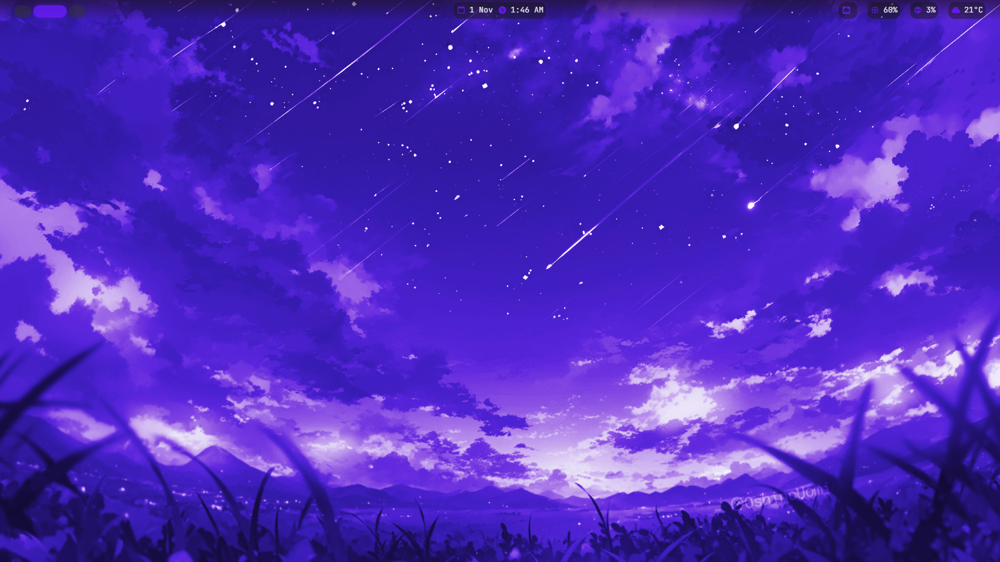
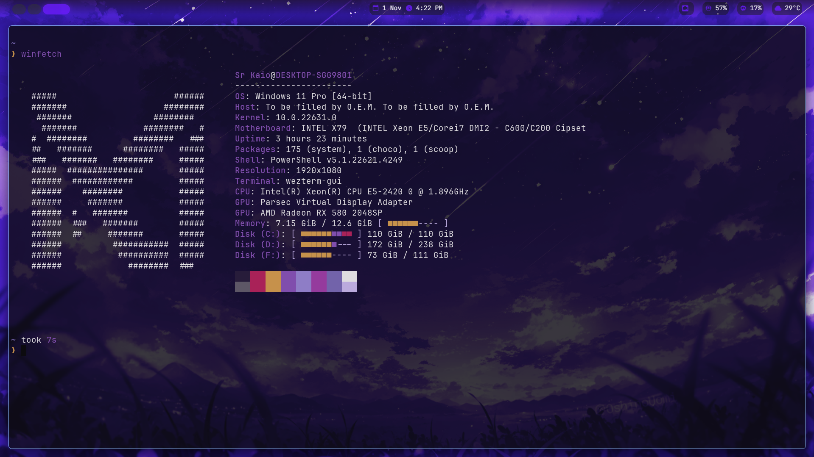
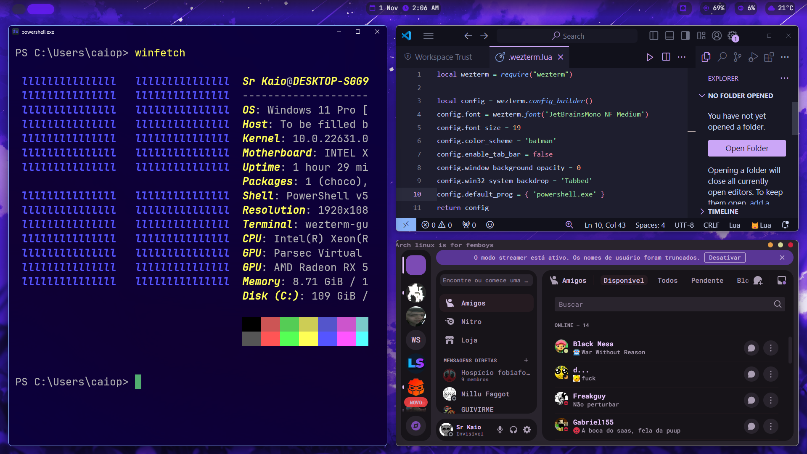

    

# My UnixCorn Setup for Windows

## Aplications used:

| Application Name | Usage | Link |
| ------------- | ------------- | ------------ |
| GlazeWM  | Window Manager for Windows | [Github Page](https://github.com/glzr-io/glazewm) |
| Zebar  | The Top Bar | [Github Page](https://github.com/glzr-io/zebar) |
| WezTerm  | Pretty Terminal | [Download Link](https://wezfurlong.org/wezterm/index.html) |
| StarShip  | Customizable prompt for WezTerm | [Download Link](https://starship.rs/) |
| WinFetch  | NeoFetch for Windows | [Github Page](https://github.com/lptstr/winfetch) |

## Config Location:

| Name | Path |
| ------------- | ------------- |
| winfetch | C:\Users\USERNAME\\.config\winfetch\ |
| zebar  | C:\Users\USERNAME\\.glzr\zebar\starter\ |
| glazewm  | C:\Users\USERNAME\\.glzr\glazewm\ |
| wezterm  | C:\Users\USERNAME\ |
